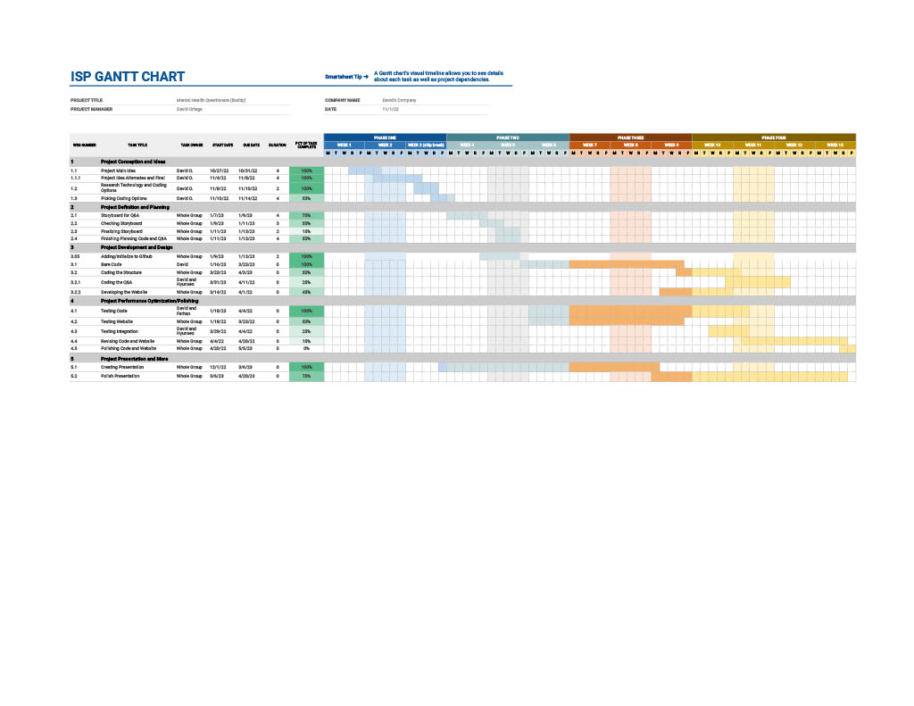

# 2023-ISP-TherapySession

## Description
> Our ISP will be a website made of Java Script code in HTML that counsels people about mental health issues using questionnaire and gives them advice. The code will be interactive that collects data from the user while keeping anonymous with the session. At the end, based on their question, we'll give you a specific answer that best fits their problem. It will also be very polished with animations and have many question options to enlighten users. We can even design a mascot for our website.

## The Roles of Team Members
> ### Software Development Engineer
> - ImaCoderLol ([David Ortega](https://codermerlin.com/users/david-ortega/Digital%20Portfolio/index.html))
> - HyunseoLee0 ([Hyunseo Lee](https://codermerlin.com/users/hyunseo-lee/Digital%20Portfolio/index.html))
> ### QA Engineer
> - ImaCoderLol ([David Ortega](https://codermerlin.com/users/david-ortega/Digital%20Portfolio/index.html))
> - Farhanishhraque ([Farhan Ishraque](https://codermerlin.com/users/farhan-ishraque/Digital%20Portfolio/index.html))
> ### Project Manager
> - HyunseoLee0 ([Hyunseo Lee](https://codermerlin.com/users/hyunseo-lee/Digital%20Portfolio/index.html))
> - ImaCoderLol ([David Ortega](https://codermerlin.com/users/david-ortega/Digital%20Portfolio/index.html))
> ### Product Manager
> - Farhanishhraque ([Farhan Ishraque](https://codermerlin.com/users/farhan-ishraque/Digital%20Portfolio/index.html))
> ### Release Engineer
> - ImaCoderLol ([David Ortega](https://codermerlin.com/users/david-ortega/Digital%20Portfolio/index.html))
> - HyunseoLee0 ([Hyunseo Lee](https://codermerlin.com/users/hyunseo-lee/Digital%20Portfolio/index.html))

## [GANTT Chart] (https://docs.google.com/spreadsheets/d/1hYiP0mq1xMzHxO50O6rxT8Aybha63-Z4eePW9NowgYw/edit?usp=sharing)
> 
